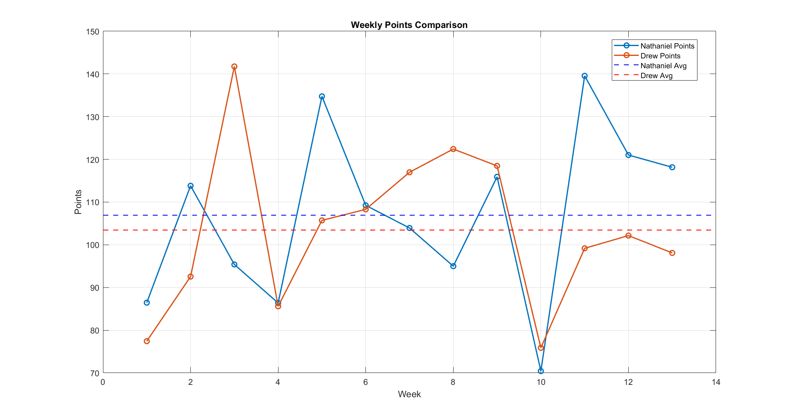
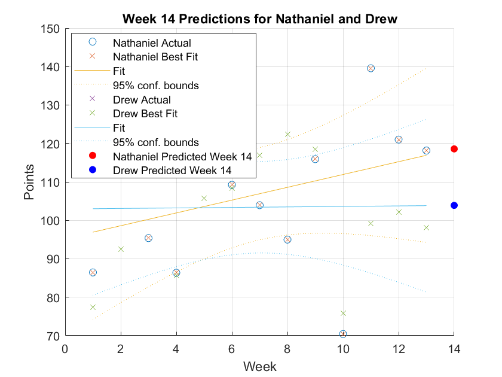
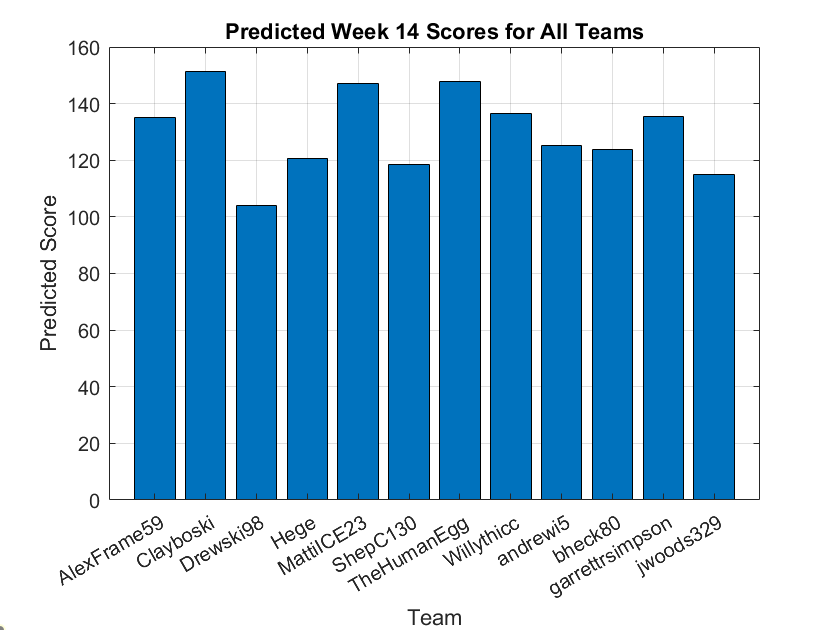
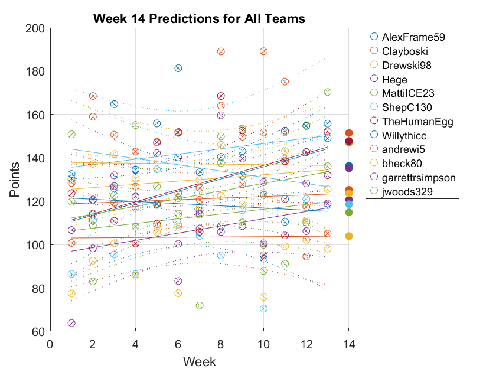

# DSE 511 HW6
#### Nathaniel Shepherd

### File Descriptions

#### **Folders**
- **html/**: Contains pdf of MATLAB Code

#### **Files**
1. **Predicted_Week_14_Scores.csv**  
   - A CSV file containing predicted scores for Week 14 of the fantasy football league.

2. **README.md**  
   - This README file provides an overview of the project files and their purposes.

3. **allpredict.png**  
   - An image showing predictions for all players in the league.

4. **alltrend.png**  
   - An image depicting overall trends of each team from weeks 1-13 and week 14 score predictions. 

5. **datatosql.ipynb**  
   - A Jupyter Notebook detailing the process of loading data from Sleeper API and saving into an SQL database.

6. **drewsnathanielavg.png**  
   - An image comparing average statistics between Drew and Nathaniel.

7. **drewsnathanielpredict.png**  
   - An image comparing predictions between Drew and Nathaniel.

8. **fantasyfootballanalysis.m**  
   - A MATLAB file containing the graphing and linear regression script for analyzing fantasy football data.

9. **sqlserversetup.sql**  
   - An SQL script to set up the server for managing fantasy football data.

---

### Introduction
One of my hobbies is fantasy football. I really enjoy being in leagues as usually there is plenty of hilarious banter and discussions to take away from the grind of graduate school. Also, they allow me to enjoy the fun parts of statistics and data science. If you do not know what fantasy football is, here is a brief description:

Fantasy football is a game that allows you to be the owner, GM and coach of your very own football team. Competing against your friends, you draft a team made up of NFL players and based on their on-field performance in a given week, you score points. For example, if you have Lamar Jackson on your team and he throws a touchdown, your team scores points. Add up all the points and the team with the most at the end of the NFL week is the winner. In addition to drafts at the start of the season, there are also auction leagues. This is another league type that will be further explained later. As the game has grown, the complexity has grown along with it. But at the end of the day, your team competes in a league typically composed of 10 or 12 teams. Each week, you go head-to-head against a different team. If a player is struggling, you can release him, just like in the NFL. You can trade with other teams. And if no one has a player on their team, they are available to be added to your roster from the waiver wire. Just like the NFL, your league has a postseason as well. The fantasy playoffs are usually played from Weeks 14-16. In the final week, a champion is crowned! You can play for fun, you can play for money. Either way, that’s fantasy football! (https://www.si.com/fantasy/2020/04/04/fantasy-football-advice-guide-for-beginners)


### Project Overview
Recently, the league owner, my friend Clay, decided to do Power Rankings to determine what the rankings for each team were. Clay decidied that my team was the #12 team out of 12. Clearly I disagreed. I knew I was definitely #11. The team above me was run by his brother Drew. So clearly there was some bias. In order to factually prove why my team was better, I decided to use this project as an opportunity to flex my data science muscles and use statistics to show why my team was #11. 


### Data Collection
The fantasy football service we use is called Sleeper. Fortunatly for me, Sleeper has a built in API that allows access to a leagues data. This works best in Python. As I wanted to compare team scores, I needed team names and each weeks total points. I also included the average age of the team per week per user. This ended up not being used but is a useful variable in seeing what team has a better future than the next. However, I wanted to do my analysis of the data in MATLAB as that is where my experience lies. 

### Data Server
As I wanted to be able to do work on the data in MATLAB, and I did not want to constantly save a .csv in Python and reupload it in MATLAB, a SQL server made the most sense. So I attached at the bottom of my Jupyter Notebook a block that saves the data to a server. 
### Data Analysis
In my MATLAB script, I first pulled in the data I wanted. Then I began my analysis. I decided I would do two things. The first would be to compare the current state of My team and Drews team. This was done by plotting the scores for our teams each week and the overall averages. This plot, seen below, clearly shows that my team is averaging more points per week that his. 


The secound thing would be score predictions. Based off our week 1-13 performance, who would score more in week 14 and were we trending down or up? This was accomplished using linear regression. The results are in the figure below. 

From the plot, it can be seen that my team is predicted to outscore Drew's and has been trending up while Drew's has been stagnet. 

#### For fun, I applied the LR model to the whole league


From these graphs, Clay is expected to score the most. 

### Discussion
When I had presented my findings to the league, I received mixed results. Some people, did agree with me, but Clay and Drew disagreed. They believed wins were a stronger measure of team rankings than points. However, in fantasy, we cannot control the other team, so we cannot play defense. In order to win, you must put what you think is the best possible team forward that has the highest chance of scoring the most points which gives you the best odds of winning. One of the members who agreed with me, had high points for, but becuase his opponents scored so much, he had a bad record. We wouldn't say his team was bad just had a lot of points against. 
### Installation
```bash
git clone https://github.com/nshephe4/dse511_project.git
cd dse511_project

```